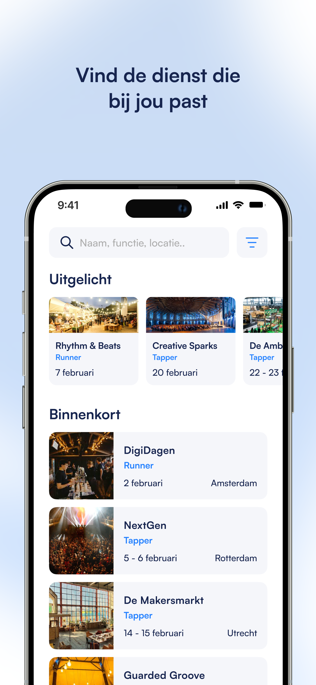
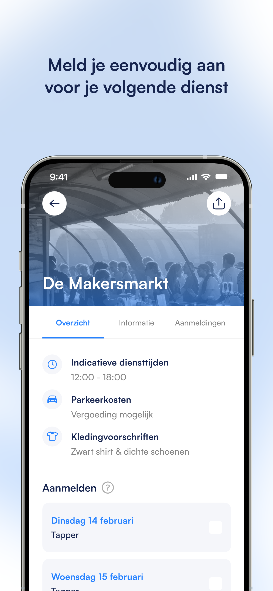
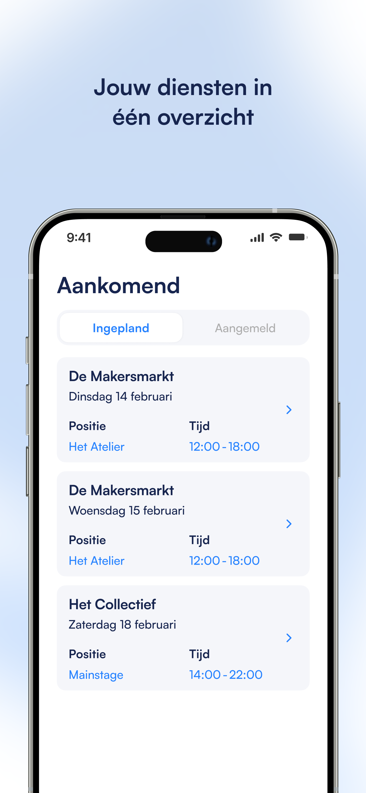
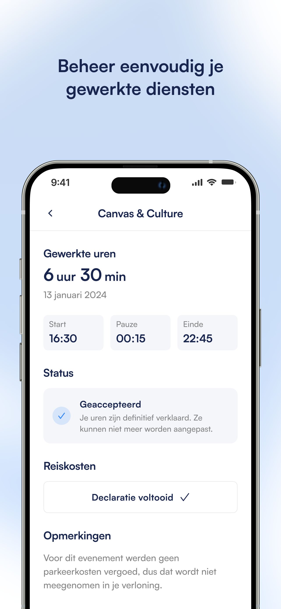

  

# 👋 Welkom bij Boomer

Boomer is jouw complete white-label planningsoplossing voor efficiënt personeelsmanagement en planning.

## 🎯 Wat bieden wij?

  

### 🚀 Belangrijkste functies

- **White-label Oplossing**: Volledig aan te passen naar jouw merk
- **Slimme Planning**: Automatische planning met onze geavanceerde autoplanner
- **Personeelsbeheer**: Eenvoudig beheer van je complete personeelsbestand
- **Urenregistratie**: Gestroomlijnde urenregistratie en validatie

  
  

## 💪 Voor wie?

- ✅ Uitzendbureaus
- ✅ Horeca ondernemingen
- ✅ Evenementenorganisaties
- ✅ Facilitaire dienstverleners

## 🛠 Technische mogelijkheden

  

- 📱 Native apps voor iOS en Android
- 🔄 API-integraties
- 🔐 Enterprise-grade beveiliging
- ☁️ Schaalbare cloud-infrastructuur

## 📞 Contact

- 📧 Email: info@okboomr.nl
- 🏢 Adres: Rigakade 10, Amsterdam
- 🌐 Website: [heyboomer.nl](https://heyboomer.nl)

---

  <b>Klaar om je planning naar het volgende niveau te tillen?</b> 
  <a href="https://heyboomer.nl/demo">Vraag een demo aan</a>

